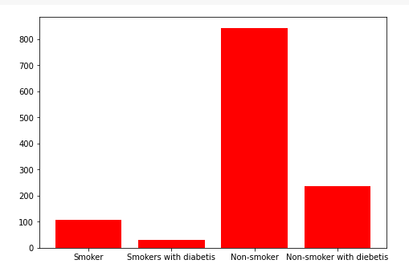

# Diabetes

 

## Goal:
The goal of this project was to analyze the diabetes dataset and find out more about this diasease. The purpose
	was to know how different aspects of our lifestyle can impact our health and can cause diabetes.
            Used pandas and seaborn to analyze the data and plot the graphs for visual representation.
            
### Technology used:
Python, Pandas, seaborn

### Contributor:
Tanusree Debnath

